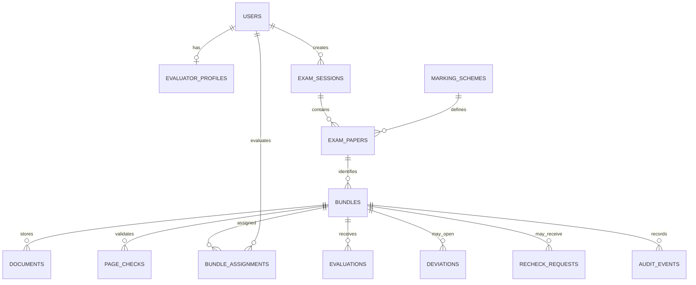

# DRISHTI Entity Relationship Map

`bundles` is the existing answer-sheet record. It is not a separate paper-bundle abstraction: one bundle stores one candidate's captured answer booklet and its operational state.

## Relationship rules

- `examPapers.examSessionId` establishes session isolation for every QR-linked answer sheet.
- `bundles.examPaperId`, `bundles.intakeQrToken`, and `bundles.schemeId` are populated from the verified QR context at scanner intake.
- `bundleAssignments` is the sole evaluator-assignment record; only its evaluator can access that bundle from the evaluator desk.
- A student re-check request is linked by `recheckRequests.bundleId`. A re-checker can access that answer sheet when either an assigned deviation or an assigned student request exists.
- `documents`, `pageChecks`, `evaluations`, `deviations`, and `auditEvents` all retain the bundle id, maintaining a single answer-sheet lineage.
