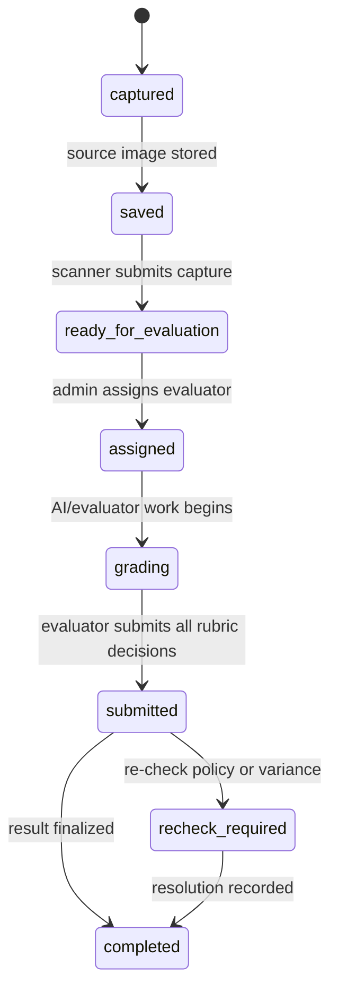

# DRISHTI State Machine

## Answer-sheet processing state

`bundles.status` is a separate result-status field (`intake`, `review`, `grading`, `moderation`, `finalized`). It is not a competing answer-sheet queue: the processing state controls operational hand-off, while status communicates result disposition.

## Guardrails

- Only `ready_for_evaluation` or an already `assigned` sheet can be assigned to an evaluator.
- Scanner submission can only follow a stored capture.
- Human submission requires every marking-scheme question to have a resolved human decision.
- A re-check request requires a finalized QR-linked answer sheet and an open window for that sheet's own examination session.
- QR revocation, expiry, inactive paper status, or a closed exam session blocks scanner intake.
