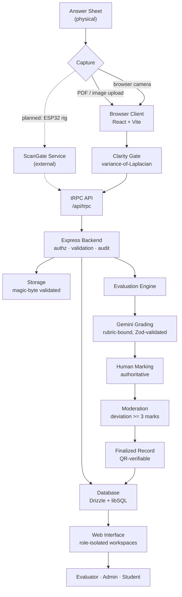

# DRISHTI

**Intelligent On-Screen Marking System**

DRISHTI is an on-screen marking (OSM) platform for examination boards and evaluation centres. It carries a physical answer sheet from scan intake through clarity review, rubric-bound marking, AI-assisted grading and moderation, to a QR-verifiable finalized record.

[](#testing)
[](https://www.typescriptlang.org/)
[](https://nodejs.org/)

---

## Overview

Manual answer-sheet evaluation is slow, physically distributed and hard to audit. Scripts move between centres, marks are transcribed by hand, and a disputed result is difficult to reconstruct after the fact. Blurred or missing pages are often discovered only after an evaluator has already begun marking.

DRISHTI addresses this by keeping the entire evaluation on screen and making every step attributable:

- **Intake is bound to identity.** A scan cannot become an evaluable bundle without resolving a signed intake QR that ties it to a registered exam paper and session.
- **Quality is gated before marking.** Every rendered page is measured for sharpness at intake; blurry pages are flagged for replacement rather than silently entering evaluation.
- **Marking is rubric-bound.** Marks are validated against a configured per-question maximum in 0.5-mark increments, and a paper cannot be finalized while any question is unmarked or under review.
- **AI assists, humans decide.** Gemini produces a rubric-referenced suggestion with evidence and confidence. It is never the authority — a human mark is always required, and a gap of three or more marks between AI and human opens a moderation deviation.
- **Every action is audited.** State transitions write to an append-only audit trail scoped to the bundle.

The system is designed so that **hardware capture is an input, not a dependency**. It runs today entirely on uploaded and browser-captured images; a future camera rig plugs into the same pipeline. See [Hardware Architecture](#hardware-architecture).

---

## Key Features

### Current Features

| Feature | Description |
| --- | --- |
| **Role-isolated workspaces** | Five roles — Admin, School Admin, Evaluator, Scanner, Student — each with a distinct workspace and server-enforced scoping |
| **Signed QR intake** | HMAC-SHA256 intake tokens with schema versioning, expiry and revocation; a public verification endpoint for finalized records |
| **Multi-source scan intake** | PDF upload, multi-image upload, and browser-camera capture, all through one validation path |
| **Page clarity gate** | Variance-of-Laplacian sharpness scoring per page, with blurry-page replacement before marking |
| **Rubric-bound marking** | Per-question maxima, 0.5-mark increments, decision states (accept / modify / override / review), and teacher annotations positioned on the page |
| **AI-assisted grading** | Gemini question-first vision grading with Zod-validated output, criterion-level evidence, confidence scores and automatic retry on invalid responses |
| **Moderation** | Deviations opened automatically when AI and human marks differ by 3+, with an admin resolution queue |
| **Assignment workflow** | Admin assigns submitted bundles to evaluators; evaluators see only their assigned papers |
| **Re-check requests** | Students request a re-check against a verification token; admins review and resolve |
| **Audit trail** | Append-only, bundle-scoped event log across the full lifecycle |
| **Demo mode** | A fully seeded demonstration dataset on a separate database, so demos never touch real data |

### Planned Features

| Feature | Status |
| --- | --- |
| Physical camera capture rig (ESP32-S3 + ScanGate) | Provider interface implemented; device not yet certified |
| Handwriting OCR | Not implemented |
| Perspective correction / deskew / auto-crop | Not implemented |
| Server-side image enhancement | Not implemented — currently owned by the external ScanGate service |
| Push-based realtime updates | Currently five-second polling |
| Cloud deployment (managed DB + object storage) | Architecture documented, not yet provisioned |

---

## System Architecture



Dotted edges are planned integrations, not current behaviour.

---

## Technology Stack

| Layer | Technology |
| --- | --- |
| **Frontend** | React 19, Vite 7, TypeScript 5.9, Tailwind CSS v4, Radix UI, wouter (routing), TanStack Query, Framer Motion, GSAP, Recharts |
| **Backend** | Node.js 20+, Express 4, tRPC v11, superjson, Zod v4 |
| **Database** | SQLite / libSQL via Drizzle ORM 0.44 (13 migrations) |
| **Storage** | Local filesystem adapter with content-type sidecars, served through a proxy route |
| **Authentication** | Local email/password with scrypt (N=16384), signed role sessions via `jose` (HS256 JWT), `httpOnly` cookies |
| **API** | tRPC (typed, end-to-end) plus a small public REST surface under `/api/v1` |
| **Image Processing** | pdf.js rendering, canvas-based variance-of-Laplacian sharpness scoring (browser-side) |
| **Computer Vision** | No in-repository CV pipeline — OCR, deskew and enhancement are owned by the external ScanGate service |
| **AI / ML** | Google Gemini (question-first vision grading), schema-validated with Zod and retried on invalid output |
| **Hardware** | ESP32-S3 over CH343 USB-UART, `serialport` bridge (standalone CLI, not a server dependency) |
| **Testing** | Vitest (100 tests), Playwright available for future E2E |
| **Deployment** | Vite production build plus esbuild server bundle. See [Deployment](#deployment) |

---

## Software Architecture

```
Frontend (React SPA)
    |  typed tRPC client, cookie-based role session
    v
API Layer (/api/trpc + /api/v1)
    |  Zod input validation, role middleware
    v
Backend (Express)
    |  authorization, business logic, audit
    +--------------+--------------+
    v              v              v
Database        Storage        Evaluation
(Drizzle)     (validated)     (Gemini + human)
```

Authorization is enforced at the backend, never by the client. Every bundle-scoped read and write resolves ownership through a central gate:

- **Operator** — only captures created by that scanner desk
- **Evaluator** — only bundles explicitly assigned to them
- **School Admin** — only bundles belonging to their own school
- **Student** — only their own record
- **Admin** — full scope

A session that cannot be resolved to a user identity is rejected rather than treated as unrestricted.

---

## Workflow

1. **Configure** — an admin creates an exam session, registers subject papers, and issues signed intake QR labels.
2. **Scan** — the scanner desk resolves the intake QR, captures or uploads pages, and reviews the per-page clarity result.
3. **Validate & store** — the server checks magic bytes and size limits, discards the client filename, and writes the object under a normalised key.
4. **Assign** — the admin assigns the submitted bundle to an evaluator.
5. **Mark** — the evaluator opens the workspace, optionally requests an AI suggestion, and records the authoritative human mark per question.
6. **Moderate** — deviations of three or more marks between AI and human enter the admin moderation queue.
7. **Finalize** — with every question marked and reviews resolved, the paper is finalized and a verifiable result QR is issued.
8. **Verify / re-check** — the finalized record is publicly verifiable by token; students may raise a re-check request.

---

## Hardware Architecture

> **Status: planned / future integration.** The deployed software does **not** require any hardware. All current workflows run on uploaded and browser-captured images.

The intended capture rig comprises:

- ESP-based controller (ESP32-S3)
- Camera module
- Nextion display
- Two LED strips
- MOSFET-based LED switching

**Boundary.** No firmware, display protocol, GPIO map, or lighting control source exists in this repository — those belong to the external ScanGate project. This repository contains only the consumer side: a provider interface (`status`, `arm`, `findNextCapture`) with three adapters, one of which is a serial bridge CLI.

Verified by import graph: `serialport` is imported in exactly one file, `tools/scangate-usb-agent/index.ts`, which is a standalone CLI. **Nothing on the server path imports it.**

When the rig is connected, captured frames rejoin the pipeline at the validation stage:

```
Camera -> Controller -> Network -> Existing API -> Existing pipeline
```

Nothing downstream of intake needs rewriting.

---

## Research Paper

<div align="center">

### Official Research Reference

**[Read the DRISHTI Research Paper](https://drive.google.com/file/d/1HmCPa5SK_tZPnvIFK1MQLxnkW6cJ1W1N/view)**

</div>

---

## Project Status

Legend: 🟢 Implemented · 🟡 In Development · 🔵 Planned

| Component | Status | Notes |
| --- | --- | --- |
| Frontend | 🟢 | Role-isolated workspaces; production build verified |
| Backend / API | 🟢 | Express + tRPC; 75 procedures, each with an explicit auth level |
| Database | 🟢 | Drizzle + libSQL, 13 migrations |
| Authentication | 🟢 | scrypt hashes, signed sessions, rate-limited sign-in |
| Authorization | 🟢 | Backend-enforced, verified against a running server |
| Storage | 🟡 | Works and is traversal-safe; local disk is not durable, and the serving route is not yet session-checked |
| Scan intake | 🟢 | PDF, multi-image and browser camera |
| Clarity gate | 🟡 | Runs browser-side; the server validates its shape, not its truthfulness |
| OCR / deskew / enhancement | 🔵 | Not implemented in this repository |
| AI grading | 🟢 | Requires a configured `GEMINI_API_KEY` |
| Evaluation & moderation | 🟢 | Deterministic marks, automatic deviation detection |
| QR issuance & verification | 🟢 | Signed, versioned, revocable |
| Re-check workflow | 🟢 | Student request, admin resolution |
| Hardware capture | 🔵 | Interface implemented; device not certified |
| Cloud deployment | 🔵 | See [Deployment](#deployment) |

---

## Security

Sensitive configuration is supplied exclusively through environment variables and is **never committed**. `.env` and all `.env.*` files are git-ignored; only `.env.example`, which contains placeholder names and no values, is tracked.

Implemented controls:

- **Password storage** — scrypt (N=16384, r=8, p=1) with a random 16-byte salt and constant-time comparison; plaintext passwords are never stored or returned.
- **Sessions** — HS256 JWTs in `httpOnly` cookies, checked against account role and active status on every request.
- **Rate limiting** — sign-in is throttled per account and per address; the public re-check endpoint is throttled per address.
- **Upload validation** — magic-byte verification (not declared MIME), size limits, and client filenames discarded.
- **Path safety** — storage keys are normalised and re-checked against the storage root; traversal attempts are rejected.
- **Error masking** — internal errors never relay provider, storage or database details to the client.

**Known gap:** the storage serving route (`/manus-storage/*`) does not yet perform a session check. Object keys carry a random suffix, but that is obscurity rather than authorization. See `docs/IMAGE_PROCESSING.md`.

If you believe you have found a vulnerability, please report it privately rather than opening a public issue.

---

## Local Development

### Prerequisites

- Node.js 20 or newer
- pnpm

### Installation

```bash
git clone https://github.com/aDiii1633/drishti.git
cd drishti
pnpm install
```

### Environment setup

```bash
cp .env.example .env    # Windows: copy .env.example .env
```

Then fill in local values. At minimum, set `JWT_SECRET` and `QR_SIGNING_SECRET` to long random strings — production mode refuses to start with placeholder or short secrets.

Create a role account before using the login pages:

```bash
pnpm auth:user -- --role admin --email admin@example.com --password "use-a-long-password" --name "Drishti Admin"
```

Valid roles: `admin`, `school_admin`, `evaluator`, `student`, and `scanner` (mapped to the persisted `operator` role).

### Development

```bash
pnpm dev            # start the dev server on http://localhost:3000
pnpm data:seed-demo # seed the demonstration dataset
```

### Verification and build

```bash
pnpm check          # TypeScript type check
pnpm test           # Vitest suite
pnpm build          # production build
pnpm start          # run the production build
```

---

## Deployment

> **Status: not yet deployed.** The build is verified locally; no production environment is provisioned.

DRISHTI currently builds to **two artifacts**:

| Artifact | Output | Nature |
| --- | --- | --- |
| SPA client | `dist/public` | Static assets |
| API server | `dist/index.js` | Long-running Node HTTP server |

### Platform compatibility

The static client deploys to Vercel without modification. **The server does not**, for three concrete reasons:

1. **No long-running process.** `server/_core/index.ts` calls `http.createServer(app).listen()`. Vercel runs serverless functions, not persistent servers.
2. **File-backed database.** `DATABASE_URL` defaults to `file:local-data/drishti.db`. Vercel's filesystem is ephemeral and read-only outside `/tmp`, so writes would not persist.
3. **Local-disk storage.** Uploads are written under `local-storage/`, which has the same persistence problem.

### Recommended architecture

Two workable options, both preserving the existing codebase:

**Option A — split deployment (least code change)**

```
Static client   ->  Vercel
API server      ->  a container/VM host (Railway, Render, Fly.io)
Database        ->  Turso (libSQL)
Object storage  ->  S3-compatible bucket
```

**Option B — all on Vercel (requires code changes)**

Wrap the Express app as a serverless handler, then replace the two persistence layers:

- **Database** — the driver is already `@libsql/client`, so this is an environment change only: point `DATABASE_URL` at a `libsql://` Turso URL and add an auth token.
- **Storage** — `server/storage.ts` needs an object-storage adapter. Its interface (`storagePut`, `storageGet`, `storageGetBuffer`, `storageDelete`) is small and already abstracted.
- **In-memory state** — the rate limiter and hardware capture sessions become per-invocation and must move to a shared store.

Either option requires provisioning external services. See `docs/DEPLOYMENT.md`.

### Required environment variables

| Variable | Purpose | Required for |
| --- | --- | --- |
| `JWT_SECRET` | Signs role sessions | **All modes** |
| `QR_SIGNING_SECRET` | Signs intake QR tokens | **All modes** |
| `DATABASE_URL` | Primary database connection | **All modes** |
| `NODE_ENV` / `PORT` | Runtime mode and listen port | All modes |
| `APP_MODE`, `DEMO_MODE`, `DEMO_DATABASE_URL`, `DRISHTI_DEMO_PASSWORD` | Demonstration runtime on a separate database | Demo mode |
| `GEMINI_API_KEY` | Gemini grading and assistant | AI grading |
| `GEMINI_GRADING_MODEL`, `GEMINI_MODEL`, `GEMINI_BASE_URL` | Model and endpoint selection | Optional |
| `PUBLIC_APP_URL` | Absolute URLs for stored files behind a proxy | Hosted deploys |
| `SCANGATE_*` | Capture gateway and USB bridge | Hardware capture |
| `OFFICIAL_EMAIL_DOMAIN`, `VITE_APP_ID`, `OAUTH_SERVER_URL`, `OWNER_OPEN_ID`, `BUILT_IN_FORGE_*` | Optional hosted integrations | Optional |

Never commit real values. Configure them in the hosting provider's environment settings.

---

## Repository Structure

```
drishti/
├── client/              # React SPA
│   └── src/
│       ├── components/  # Shared UI and layout
│       ├── pages/       # Route-level workspaces
│       ├── lib/         # pdf.js rendering, clarity gate, tRPC client
│       └── hooks/
├── server/              # Express + tRPC backend
│   ├── _core/           # Server bootstrap, context, storage proxy
│   ├── routers.ts       # tRPC procedure surface
│   ├── aiGrading.ts     # Gemini grading
│   ├── gradeEngine.ts   # Scheme extraction, denominators
│   ├── hardwareScanner.ts   # Hardware provider abstraction
│   ├── storage.ts       # Filesystem storage adapter
│   └── *.test.ts        # Vitest suites
├── shared/              # Types shared by client and server
├── drizzle/             # Schema and migrations
├── scripts/             # Provisioning, seeding, lifecycle checks
├── tools/
│   └── scangate-usb-agent/   # Standalone ESP32 serial bridge CLI
├── docs/                # Architecture, API, database, testing, hardware
├── patches/
└── research/
```

Runtime directories (`local-data/`, `local-storage/`, `dist/`, `.artifacts/`) are created on demand and git-ignored.

---

## Documentation

| Document | Contents |
| --- | --- |
| [`docs/ARCHITECTURE.md`](docs/ARCHITECTURE.md) | System and module architecture |
| [`docs/API.md`](docs/API.md) | Endpoint surface, authorization model, rate limits |
| [`docs/DATABASE.md`](docs/DATABASE.md) | Schema and migrations |
| [`docs/IMAGE_PROCESSING.md`](docs/IMAGE_PROCESSING.md) | The real pipeline, with explicit unimplemented boundaries |
| [`docs/TECH_STACK.md`](docs/TECH_STACK.md) | Technology decisions |
| [`docs/TESTING.md`](docs/TESTING.md) | Automated gates and manual checklists |
| [`docs/DEPLOYMENT.md`](docs/DEPLOYMENT.md) | Deployment guidance |
| [`docs/HARDWARE.md`](docs/HARDWARE.md) | Hardware boundary and integration contract |
| [`docs/IMPLEMENTATION_STATUS.md`](docs/IMPLEMENTATION_STATUS.md) | Audited, per-component status with verification evidence |

---

## Testing

```bash
pnpm check    # TypeScript, exit 0
pnpm test     # 100 passed, 2 skipped, 33 files
pnpm build    # production build, exit 0
```

The suite covers authentication, role authorization, rate limiting, QR signing and verification, upload validation, storage safety, scanner adapters, grading validation and retry, evaluation entry points, annotations, re-checks, and admin metrics. Tests requiring external provider credentials are skipped when those credentials are absent rather than being silently faked.

Not covered: browser-driven end-to-end tests, live Gemini calls, and physical device verification.

---

## Contributing

1. Create a feature branch from `main`.
2. Make focused changes and keep existing behaviour intact.
3. Run `pnpm check`, `pnpm test` and `pnpm build` — all must pass.
4. Confirm no secrets are staged (`git diff --cached`).
5. Update the relevant document in `docs/` when architecture, APIs, the database or deployment change.
6. Use conventional commit messages (`feat:`, `fix:`, `refactor:`, `docs:`, `chore:`).

Please do not mark a capability as working in documentation unless its verification has actually passed.

---

## Research / Future Scope

These are directions for future work, not current capabilities:

- **Handwriting recognition** for automatic answer transcription, reducing evaluator reading load.
- **Geometric normalisation** — perspective correction, deskew and boundary detection — to make camera capture as reliable as flatbed scanning.
- **Server-side quality verification**, so the clarity gate becomes a trustworthy control rather than an operator aid.
- **Calibration of AI grading against human marks** at scale, to quantify agreement per subject and question type.
- **Full hardware capture integration** with the ESP32-S3 rig and controlled lighting.
- **Horizontal scalability** — shared-store rate limiting and session state for multi-replica deployment.

---

## License

`package.json` declares the **MIT** license, but **no `LICENSE` file is currently present in this repository**. Until one is added, the licensing terms should be treated as unsettled — adding an MIT `LICENSE` file would make the declared intent binding.
